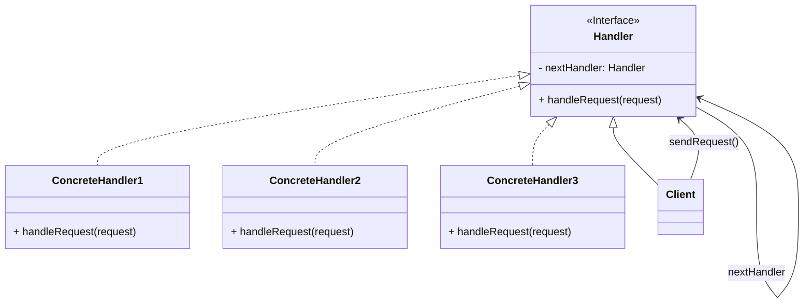

# Chain of Responsibility

The Chain of Responsibility is a behavioral design pattern that helps in passing a request along a chain of handlers. 

The Chain of Responsibility pattern is like a relay race. In a relay race, each runner passes the baton to the next runner. Similarly, in this pattern, a request is passed along a chain of handlers.

Each handler decides either to process the request or to pass it along the chain. This pattern promotes loose coupling and allows multiple objects to handle a request without the sender needing to know which object will ultimately process it.

Here are the main components of the Chain of Responsibility pattern:



1. **Handler Interface/Abstract Class**:
   - This defines the interface for handling the requests. It usually contains a method for handling the request and a reference to the next handler in the chain.

2. **Concrete Handlers**:
   - These are the actual handlers that implement the Handler interface. Each concrete handler has a reference to the next handler in the chain.

3. **Client**:
   - This is the object that initiates the request. It sends the request to the first handler in the chain.

Now, let's break down how the pattern works:

1. **Request Propagation**:
   - When a request is made by the client, it is sent to the first handler in the chain.

2. **Handling the Request**:
   - The first handler decides whether it can handle the request. If it can, it processes the request and returns a response. If not, it passes the request to the next handler in the chain.

3. **Passing the Request**:
   - If the current handler can't handle the request, it passes the request to the next handler in the chain. This continues until a handler is found that can process the request.

4. **End of Chain**:
   - If no handler in the chain can process the request, it may be handled in a default way or an error may be returned.

5. **Response Propagation**:
   - The response (if any) is passed back through the chain in the reverse order, until it reaches the client.

**Benefits**:

- **Loose Coupling**: The sender doesn't need to know which object will ultimately process the request. It only needs to know the first handler in the chain.

- **Dynamic Handling**: Handlers can be added, removed, or reordered dynamically without affecting the client's code.

- **Single Responsibility**: Each handler has the responsibility to process a specific type of request.

**Drawbacks**:

- **Unprocessed Requests**: If the chain is not configured properly, a request might go unprocessed.

- **Performance Overhead**: If the chain is long, it can add some performance overhead as each handler is invoked in sequence.

**Examples**:

1. **Middleware in Web Applications**:
   - In web development, middleware functions often use the Chain of Responsibility pattern. Each middleware can process an HTTP request and either handle it or pass it to the next middleware.

2. **Event Handling**:
   - In GUI programming, events are often handled using a chain of event handlers. Each handler checks if it can handle the event, and if not, passes it to the next handler.

3. **Logging and Error Handling**:
   - Loggers can use the Chain of Responsibility to determine where to output log messages based on their severity.

Remember, the key idea is that the responsibility for handling a request is spread across a chain of handlers, with each handler either processing the request or passing it to the next handler in line.

### Example

Let's implement the Chain of Responsibility design pattern using a real-world example of `expense approval in a company`. In this scenario, expenses need to go through a chain of approvers, each with a different spending limit authority.

### Step 1: Define the Handler Interface

```java
public interface Approver {
    void setNextApprover(Approver nextApprover);
    void approveExpense(Expense expense);
}
```

### Step 2: Implement the Concrete Handlers

```java
public class TeamLead implements Approver {
    private double approvalLimit = 1000;
    private Approver nextApprover;

    @Override
    public void setNextApprover(Approver nextApprover) {
        this.nextApprover = nextApprover;
    }

    @Override
    public void approveExpense(Expense expense) {
        if (expense.getAmount() <= approvalLimit) {
            System.out.println("Team Lead approved the expense of $" + expense.getAmount());
        } else if (nextApprover != null) {
            nextApprover.approveExpense(expense);
        }
    }
}

public class Manager implements Approver {
    private double approvalLimit = 5000;
    private Approver nextApprover;

    @Override
    public void setNextApprover(Approver nextApprover) {
        this.nextApprover = nextApprover;
    }

    @Override
    public void approveExpense(Expense expense) {
        if (expense.getAmount() <= approvalLimit) {
            System.out.println("Manager approved the expense of $" + expense.getAmount());
        } else if (nextApprover != null) {
            nextApprover.approveExpense(expense);
        }
    }
}

public class FinanceManager implements Approver {
    private double approvalLimit = 10000;

    @Override
    public void setNextApprover(Approver nextApprover) {
        // Finance Manager is the highest authority and doesn't have a next approver
    }

    @Override
    public void approveExpense(Expense expense) {
        if (expense.getAmount() <= approvalLimit) {
            System.out.println("Finance Manager approved the expense of $" + expense.getAmount());
        } else {
            System.out.println("Expense exceeds the maximum limit. Additional approvals required.");
        }
    }
}
```

### Step 3: Create an Expense Class

```java
public class Expense {
    private double amount;

    public Expense(double amount) {
        this.amount = amount;
    }

    public double getAmount() {
        return amount;
    }
}
```

### Step 4: Implement the Client Class

```java
public class ExpenseApprovalClient {
    public static void main(String[] args) {
        // Create Approvers
        Approver teamLead = new TeamLead();
        Approver manager = new Manager();
        Approver financeManager = new FinanceManager();

        // Chain them together
        teamLead.setNextApprover(manager);
        manager.setNextApprover(financeManager);

        // Create expenses
        Expense expense1 = new Expense(500); // Team Lead approves
        Expense expense2 = new Expense(4500); // Manager approves
        Expense expense3 = new Expense(12000); // Finance Manager approves

        // Submit expenses for approval
        teamLead.approveExpense(expense1);
        System.out.println("----------------------");
        teamLead.approveExpense(expense2);
        System.out.println("----------------------");
        teamLead.approveExpense(expense3);
    }
}
```

### Step 5: Run the Client Class

When you run the `ExpenseApprovalClient`, you will see the output indicating which approver approved each expense.

Output:

```
Team Lead approved the expense of $500
----------------------
Manager approved the expense of $4500
----------------------
Finance Manager approved the expense of $12000
```

### Example 

Let's consider a real-world example of a customer support ticketing system. In this scenario, a support ticket goes through different levels of support agents until it is resolved.

### Step 1: Define the Handler Interface

```java
public interface SupportHandler {
    void setNextHandler(SupportHandler nextHandler);
    void handleTicket(Ticket ticket);
}
```

### Step 2: Implement the Concrete Handlers

```java
public class Level1Support implements SupportHandler {
    private SupportHandler nextHandler;

    @Override
    public void setNextHandler(SupportHandler nextHandler) {
        this.nextHandler = nextHandler;
    }

    @Override
    public void handleTicket(Ticket ticket) {
        if (ticket.getPriority() <= 2) {
            System.out.println("Level 1 Support handled ticket #" + ticket.getId());
        } else if (nextHandler != null) {
            nextHandler.handleTicket(ticket);
        }
    }
}

public class Level2Support implements SupportHandler {
    private SupportHandler nextHandler;

    @Override
    public void setNextHandler(SupportHandler nextHandler) {
        this.nextHandler = nextHandler;
    }

    @Override
    public void handleTicket(Ticket ticket) {
        if (ticket.getPriority() <= 4) {
            System.out.println("Level 2 Support handled ticket #" + ticket.getId());
        } else if (nextHandler != null) {
            nextHandler.handleTicket(ticket);
        }
    }
}

public class Level3Support implements SupportHandler {
    @Override
    public void setNextHandler(SupportHandler nextHandler) {
        // Level 3 Support is the highest authority and doesn't have a next handler
    }

    @Override
    public void handleTicket(Ticket ticket) {
        System.out.println("Level 3 Support handled ticket #" + ticket.getId());
    }
}
```

### Step 3: Create a Ticket Class

```java
public class Ticket {
    private int id;
    private int priority;

    public Ticket(int id, int priority) {
        this.id = id;
        this.priority = priority;
    }

    public int getId() {
        return id;
    }

    public int getPriority() {
        return priority;
    }
}
```

### Step 4: Implement the Client Class

```java
public class TicketingSystemClient {
    public static void main(String[] args) {
        // Create Support Handlers
        SupportHandler level1 = new Level1Support();
        SupportHandler level2 = new Level2Support();
        SupportHandler level3 = new Level3Support();

        // Chain them together
        level1.setNextHandler(level2);
        level2.setNextHandler(level3);

        // Create tickets with different priorities
        Ticket ticket1 = new Ticket(101, 3); // Level 2 Support handles
        Ticket ticket2 = new Ticket(102, 1); // Level 1 Support handles
        Ticket ticket3 = new Ticket(103, 5); // Level 3 Support handles

        // Submit tickets for handling
        level1.handleTicket(ticket1);
        System.out.println("----------------------");
        level1.handleTicket(ticket2);
        System.out.println("----------------------");
        level1.handleTicket(ticket3);
    }
}
```

### Step 5: Run the Client Class

When you run the `TicketingSystemClient`, you will see the output indicating which support handler handled each ticket.

Output:

```
Level 2 Support handled ticket #101
----------------------
Level 1 Support handled ticket #102
----------------------
Level 3 Support handled ticket #103
```

### Example

In a functional programming environment, we can implement the Chain of Responsibility pattern using higher-order functions and recursion. Instead of using classes and objects, we'll rely on functions to process requests.

Let's adapt the customer support ticketing example to a functional programming style using Java 8+ features:

### Step 1: Define Support Handlers as Functions

```java
import java.util.function.BiConsumer;
import java.util.function.Consumer;

public class FunctionalTicketingSystem {
    public static Consumer<Ticket> level1Support = ticket -> {
        if (ticket.getPriority() <= 2) {
            System.out.println("Level 1 Support handled ticket #" + ticket.getId());
        } else {
            level2Support.accept(ticket);
        }
    };

    public static Consumer<Ticket> level2Support = ticket -> {
        if (ticket.getPriority() <= 4) {
            System.out.println("Level 2 Support handled ticket #" + ticket.getId());
        } else {
            level3Support.accept(ticket);
        }
    };

    public static Consumer<Ticket> level3Support = ticket ->
        System.out.println("Level 3 Support handled ticket #" + ticket.getId());
}
```

### Step 2: Create a Ticket Class (same as before)

```java
public class Ticket {
    private int id;
    private int priority;

    public Ticket(int id, int priority) {
        this.id = id;
        this.priority = priority;
    }

    public int getId() {
        return id;
    }

    public int getPriority() {
        return priority;
    }
}
```

### Step 3: Define a Main Function

```java
import java.util.function.Consumer;

public class TicketingSystemClient {
    public static void main(String[] args) {
        Consumer<Ticket> ticketHandler = FunctionalTicketingSystem.level1Support;

        // Create tickets with different priorities
        Ticket ticket1 = new Ticket(101, 3); // Level 2 Support handles
        Ticket ticket2 = new Ticket(102, 1); // Level 1 Support handles
        Ticket ticket3 = new Ticket(103, 5); // Level 3 Support handles

        // Submit tickets for handling
        ticketHandler.accept(ticket1);
        System.out.println("----------------------");
        ticketHandler.accept(ticket2);
        System.out.println("----------------------");
        ticketHandler.accept(ticket3);
    }
}
```

### Step 4: Run the Client Class

When you run the `TicketingSystemClient`, you will see the output indicating which support handler handled each ticket.

Output:

```
Level 2 Support handled ticket #101
----------------------
Level 1 Support handled ticket #102
----------------------
Level 3 Support handled ticket #103
```
